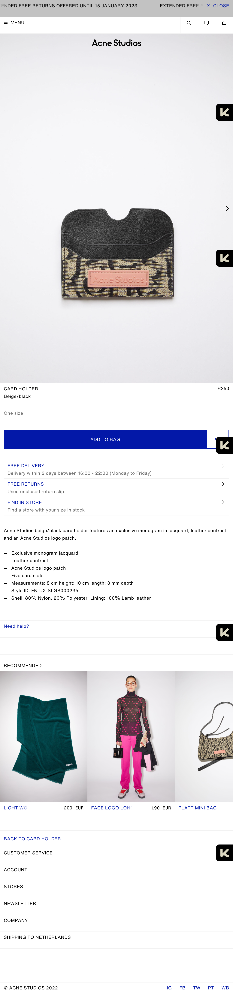

## Jij

uitwerken voor kick-off werkgroep

### Auteur:
Laiba Choudhry

#### Je startniveau:
mijn startniveau is blauw. Ik vind coderen leuk, maar ik ben nog een beginner, dus is mijn startniveau blauw

#### Je focus:
Ik wil aan de surface plane werken, ik vind voor zo een groot bedrijf, dat ze echt een mager website hebben. Ten eerste is het niet goed te lezen door een screenreader en ook dat de footer etc heel saai en mager eruit zien. Ik wil met de surface plane verschillende features aan de website toevoegen om het toch wat mooier te maken. 

## Je website

uitwerken voor kick-off werkgroep

### Je opdracht:
Ik ga aan de slag met de website van Acne Studios(acnestudios.com), ik heb voor de surface plane gekozen, ik ga aan verschillende features werken, net als animaties bij het drukken van een button. 

#### Screenshot(s) van de eerste pagina (small screen): 
hier de naam van de pagina  

#### Screenshot(s) van de tweede pagina (small screen):
hier de naam van de pagina  

## Toegankelijkheidstest 1/2 (week 1)

uitwerken na test in 8e voortgang

### Bevindingen
Lijst met je bevindingen die in de test naar voren kwamen:
Er zijn  verschillende soorten belemmeringen waarmee je rekening moet houden, in de les hadden we 3 tafels waar we verschillende toegankelijkheidstesten deden, dit was heel interessant voor mij. Tijdens de testen ben ik een paar dingen tegengekomen, zoals de screenreader werkt bij mijn website, dat ik met de tab makkelijk door de links heen kan gaan, maar daar kom ik wel een paar problemen tegen. Bij de tafel devices beperkingen  

#### Titel eerste bevinding
Tab
Hier een omschrijving van hoe het opgelost kan worden (met indien nodig een afbeelding)
Tijdens de les moesten we met keyboard only navigeren, dit kon alleen met tab. Dus tijdens het maken van je website, moet je rekening houden als je website te navigeren is door tab. (er is een programma op macbook waar je het kan testen)

#### Titel tweede bevinding. 
Contrast!

Hier een omschrijving van hoe het opgelost kan worden (met indien nodig een afbeelding)
Sommige elementen kunnen mensen met visuele beperkingen niet zien. Zo zijn sommige kleuren niet goed te zien, blur kan je ook heel slecht zien. Kijk goed naar de contrast en dat de belangrijke elementen goed te zien zijn. 

#### Titel volgende bevinding. 
Correct html

Hier een omschrijving van hoe het opgelost kan worden (met indien nodig een afbeelding)
Wanneer de screenreader door je website leest, moet je html kloppen, dus geef een label waar je de input van de gebruiker verwacht!

## Breakdownschets (week 1)

uitwerken na afloop 2e werkgroep

### de hele pagina: 

## Voortgang 1 (week 2)

uitwerken voor 1e voortgang

### Stand van zaken
Ik heb mijn HTML bijna af voor beide pagina's, alleen moet ik een paar images linken en een paar onderdelen afmaken die ik niet zo goed begreep. Hiervoor heb ik een paar vragen opgesteld die ik aan mijn docent ga vragen. 

### Agenda voor meeting
samen met je groepje opstellen

| Laiba                   | Menno                    |Hilal
| nav                     | CSS GRID                 | Breakdownschets       
| font                    | Button                   |  
| CSS bestanden           | Styling                  |
| HTML element                                     |         

### Verslag van meeting

## Voortgang 2 (week 3)

uitwerken voor 2e voortgang

### Stand van zaken
Ik ben deze week begonnen met css en ben een paar problemene tegen gekomen, zoals mijn hamburger menu werkt niet, mijn images kan ik niet vinden en een paar vragen zoals formulieren in de surface plane gebruiken
  
### Agenda voor meeting
Laiba: vraag 1 (formulieren):
Formulieren, hoe moet je erin verwerken?
Mag ik het verstoppen? 
(Surface plane)
vraag 2 (img):
3 images kan ik nergens vinden (inspect network)
Vraag 3 (hamburger menu):
ik zie naast de hamburger menu icon mijn andere icons niet 

Menno: Vraag 1: ik heb een vraag over het semantisch maken van mijn HTML, mijn CSS luistert niet en ik weet niet hoe het komt.

Hilal: Vraag 1: Doe ik de fontface goed op deze manier?
Vraag 2: Vind een carousel starten lastig, vooral als je bij het swipen de nummers ziet veranderen zoals op mijn site. Hoe kan ik dit het beste aanpakken en heb ik hier javascript voor nodig?
Vraag 3: Een stukje van me hamburger menu gaat mee bij het scrollen, waardoor komt dit?

Wessel: 
Vraag 1: Hamburger menu openen lukt, maar weer sluiten lukt niet. Hoe komt dit?
Vraag 2: Display flex items plaatsen hoe ik wil zonder, losse items van space between
Vraag 3: Hoe ontwerp je het kruisje dat input form leegt?

### Verslag van meeting
hier na afloop snel de uitkomsten van de meeting vastleggen

## Voortgang 3 (week 4)

uitwerken voor 3e voortgang

  
### Stand van zaken

### Agenda voor meeting
samen met je groepje opstellen

### Verslag van meeting
hier na afloop snel de uitkomsten van de meeting vastleggen

## Eindgesprek (week 5)

uitwerken voor eindgesprek

### Stand van zaken

### Screenshot(s)

## Bronnenlijst

continu bijhouden terwijl je werkt

- de bronnenlijst

