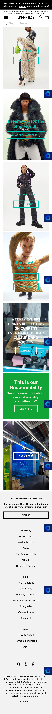
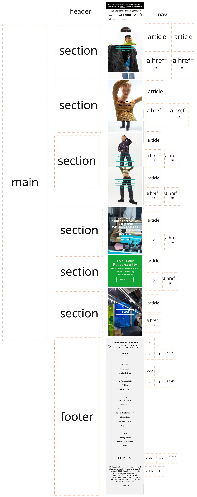

## Jij

uitwerken voor kick-off werkgroep

### Auteur:
Laiba Choudhry

#### Je startniveau:
mijn startniveau is blauw. Ik vind coderen leuk, maar ik ben nog een beginner, dus is mijn startniveau blauw

#### Je focus:
Ik wil aan responsive werken, de homepage ziet er goed uit wanneer je het kleiner maakt, maar dan kijk je naar de formulieren en andere page's die niet zo goed uit zien als je de scherm groter/ kleiner maakt. Als ik nog de tijd krijg wil ik misschien nog een leuke thema toevoegen en proberen om elementen mooi te laten zien, zo hoop ik een mooi cijfer te krijgen 

## Je website

uitwerken voor kick-off werkgroep

### Je opdracht:
Ik ga aan de slag met de website van weekday (www.weekday.com), ik wil met responsive werken en als ik nog de tijd heb een eigen kerst thema maken en een paar elementen verbeteren aan de site.   

#### Screenshot(s) van de eerste pagina (small screen): 
hier de naam van de pagina  

#### Screenshot(s) van de tweede pagina (small screen):
hier de naam van de pagina  

## Breakdownschets (week 1)

uitwerken na afloop 2e werkgroep

### de hele pagina: 

## Voortgang 1 (week 2)

uitwerken voor 1e voortgang

### Stand van zaken
Ik was er jammer genoeg niet aanwezig bij de eerste voortgang vanwege persoonlijke omstandigheden, hierdoor kon ik ook niet ver komen met de website😓

## Voortgang 2 (week 3)

uitwerken voor 2e voortgang

### Stand van zaken
Deze week hadden geleerd over grid en media queries. Dit vond ik een belangrijk onderdeel, omdat ik de @media queries moet toepassen in mijn website om het responsive te maken. Bij de 2e voortgang had ik eerlijk gezegd niet veel gedaan aan mijn website, ik was meer bezig met de opdrachten. Ik had wel geprobeerd om @media in mijn css document te zetten, ik speelde hier met de width. Dat ging best wel goed, verder moest ik uitzoeken hoe ik de hele website samen met de afbeeldingen responsive moest maken (duhhh met @media, maar hoe precies?). 
  
  
### Agenda voor meeting
samen met je groepje opstellen

| Laiba                   |  Nina                    |Hilal
| ---                     | Afbeelding               | afbeelding achtergrond         
| naar de                 | banner die niet          | op de website  
| responsive gedeelte     | meeschaalt               | dat werkt niet
| bekijken                | ...                      | ...          

### Verslag van meeting
hier na afloop snel de uitkomsten van de meeting vastleggen

- De docent legde uit hoe ik de afbeeldingen kan laten meeschalen 
- De docent heeft mij meer verteld over de elementen in mijn website

## Toegankelijkheidstest (week 4)

uitwerken na test in 8e voortgang

### Bevindingen
Lijst met je bevindingen die in de test naar voren kwamen:
Er zijn  verschillende soorten belemmeringen waarmee je rekening moet houden, in de les hadden we 3 tafels waar we verschillende toegankelijkheidstesten deden, dit was heel interessant voor mij. Tijdens de testen ben ik een paar dingen tegengekomen, zoals de screenreader werkt bij mijn website, dat ik met de tab makkelijk door de links heen kan gaan, maar daar kom ik wel een paar problemen tegen. Bij de tafel devices beperkingen  

#### Titel eerste bevinding
Tab
Hier een omschrijving van hoe het opgelost kan worden (met indien nodig een afbeelding)
Tijdens de les moesten we met keyboard only navigeren, dit kon alleen met tab. Dus tijdens het maken van je website, moet je rekening houden als je website te navigeren is door tab. (er is een programma op macbook waar je het kan testen)

#### Titel tweede bevinding. 
Contrast!

Hier een omschrijving van hoe het opgelost kan worden (met indien nodig een afbeelding)
Sommige elementen kunnen mensen met visuele beperkingen niet zien. Zo zijn sommige kleuren niet goed te zien, blur kan je ook heel slecht zien. Kijk goed naar de contrast en dat de belangrijke elementen goed te zien zijn. 

#### Titel volgende bevinding. 
Correct html

Hier een omschrijving van hoe het opgelost kan worden (met indien nodig een afbeelding)
Wanneer de screenreader door je website leest, moet je html kloppen, dus geef een label waar je de input van de gebruiker verwacht!

## Voortgang 3 (week 4)

uitwerken voor 3e voortgang

  
### Stand van zaken
Laatste voortgang gesprek!!!!
Voor de laatste voortgang gesprek had ik veel stress, ik was niet zo ver met de website en ik had het eigenlijk opgegeven. Ik hou van coderen en ik wou ook mijn website afwillen maken, maar vanwege een paar zaken die afspeelde, had ik de website niet afkunnen maken. Ik probeerde nog een paar vragen te stellen tijdens de gesprek, zoals klopt mijn html (die had ik al helemaal af)?, hoe moet ik de gif's meeschalen? en een paar dingen over github.

### Agenda voor meeting
samen met je groepje opstellen

| Laiba                           | Nina         |     
| Klopt html?                     | icons in haar footer              
| Gif meeschalen?                 | slides afbeeldingen werkt niet             
|Read.me werkt niet   

### Verslag van meeting
hier na afloop snel de uitkomsten van de meeting vastleggen

- Mij html klopt, alleen sections aria label geven.
- in footer ul en li zetten 
- Read.me werd in een ander bestand bewerkt

## Eindgesprek (week 5)

uitwerken voor eindgesprek

### Stand van zaken
hier dit ging goed & dit was lastig (neem ook screenshots op van delen van je website en code)

### Screenshot(s)

hier screenshot(s) van je eindresultaat

## Bronnenlijst

continu bijhouden terwijl je werkt

Nb. Wees specifiek ('css-tricks' als bron is bijv. niet specifiek genoeg).

1. https://codepen.io/shooft/pen/GREMMjV (dit hielp mij met @media)
2. https://codepen.io/shooft/pen/yLXzvaM 
3. https://www.youtube.com/watch?v=j1AhSWFcZpg&t=15s (legt @media uit)

